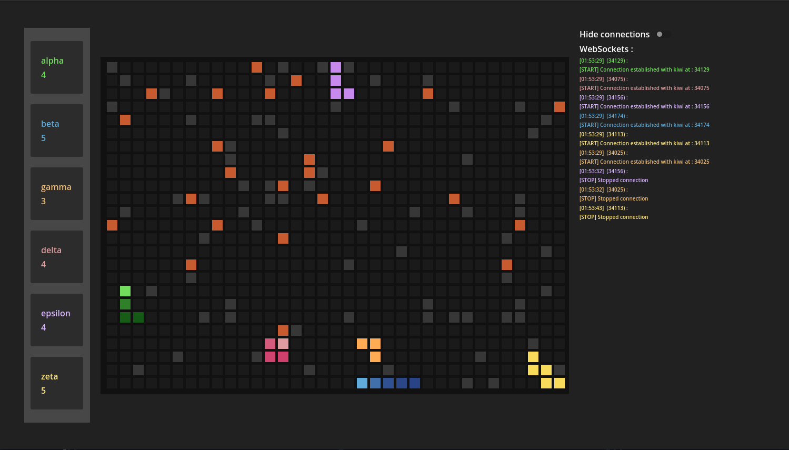

# Multiplayer snake

This repository contains a multiplayer snake meant to be used with ais as a sort of algorithmic competition

## Implementing an ai 

All the documentation on how to implement an ai is [here](python/player_code/README.md)

## Using the godot project in local

To use this project, simply clone it and open it in godot, it uses the settings for compatibility and portability with opengl backend

To adjust settings, all the game settings are in at `main_panel/main_margin/main_h_container/game_center_container/game_panel/game_container`
you can adjust them in the editor

and every ai related settings like the path of the executable used by the ai are [here](scripts/parameters.gd) aswell as the coloring